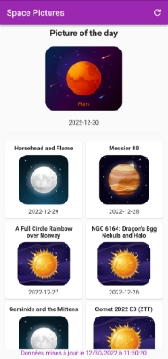
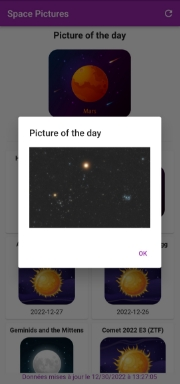



**Space Pics**

**Space Pictures**

***LARZUL Hippolyte***

**Space Pics** est une application mobile d’affichage de photos de l’espace et leurs descriptions, développée en 2022 dans le cadre du cours de Technologies Mobiles.

**Sommaire :**

`                               `Space Pictures Introduction

Contrat d’interface

API NASA

Traduction

Explications

`    `Choix

`        `Nom et Logo

`        `API

Librairies

Concepts

Parc Matériel

Fonctionnement de l’application Problèmes rencontrés

Solutions apportées

**Introduction**

**Space Pics** est une application développée en Flutter pour Android, IOS, Windows Desktop, MacOS, Linux et Web dans le cadre du cours de Technologies Mobiles à l’Université de Lille.

Cette application permet d’admirer des photos de l’espace envoyées par la Nasa une fois par jour, et en connaître davantage en anglais et en français.

La liste des images de la semaine précédente est affichée sur l’écran d’accueil. Le détail avec des informations complémentaires est disponible en cliquant sur une carte.

**Contrat d’interface**

**API NASA**

L’API principale utilisée est celle de la Nasa : [***api.nasa.gov*** et la ](https://api.nasa.gov/planetary/apod?api_key=DEMO_KEY)route utilisée pour récupérer les informations avec la méthode GET est :

|Route|Paramètres|Code de retour|
| - | - | - |
|[https://api.nasa.gov/planetary/apod](https://api.nasa.gov/planetary/apod?api_key=DEMO_KEY)|api\_key : string start\_date : string|200 ; 500|

**Réponse :** *(api\_key=DEMO\_KEY&start\_date=2022-09-01)*

[ 

`  `{ 

`    `"copyright": "Peter Kohlmann", 

`    `"date": "2022-09-01", 

`    `"explanation": "Framing a bright emission region, this telescopic view looks out along the plane of our Milky Way Galaxy toward th     "hdurl": "https://apod.nasa.gov/apod/image/2209/TulipCygX-1.jpg", 

`    `"media\_type": "image", 

`    `"service\_version": "v1", 

`    `"title": "The Tulip and Cygnus X-1", 

`    `"url": "https://apod.nasa.gov/apod/image/2209/TulipCygX-1\_1024.jpg" 

`  `}, 

`  `{ 

`    `"copyright": "Fabian Neyer", 

`    `"date": "2022-09-02", 

`    `"explanation": "Find the Big Dipper and follow the handle away from the dipper's bowl until you get to the last bright star. Then,     "hdurl": "https://apod.nasa.gov/apod/image/2209/m51\_l2.jpg", 

`    `"media\_type": "image", 

`    `"service\_version": "v1", 

`    `"title": "M51: The Whirlpool Galaxy", 

`    `"url": "https://apod.nasa.gov/apod/image/2209/m51\_l2\_1024.jpg" 

`  `}, 

`  `{ 

`    `"copyright": "Wang Letian", 

`    `"date": "2022-09-03", 

`    `"explanation": "On August 25 Sun and Moon could both be seen in planet Earth's daytime skies. And so could the International Space     "hdurl": "https://apod.nasa.gov/apod/image/2209/Interval29seconds\_Transit.jpg", 

`    `"media\_type": "image", 

`    `"service\_version": "v1", 

`    `"title": "Sun and Moon and ISS", 

`    `"url": "https://apod.nasa.gov/apod/image/2209/Interval29seconds\_Transit1200.jpg" 

`  `}, 

`  `{ 

`    `"copyright": "Rudy Montoya", 

`    `"date": "2022-09-04", 

`    `"explanation": "very step caused the sand to light up blue. That glow was bioluminescence -- a blue radiance that also lights the     "hdurl": "https://apod.nasa.gov/apod/image/2209/MilkyWayOregon\_Montoya\_1500.jpg", 

`    `"media\_type": "image", 

`    `"service\_version": "v1", 

`    `"title": "Sea and Sky Glows over the Oregon Coast", 

`    `"url": "https://apod.nasa.gov/apod/image/2209/MilkyWayOregon\_Montoya\_960.jpg" 

`  `}, 

`  `{ 

`    `"date": "2022-09-05", 

`    `"explanation": "Stars created these cliffs. Specifically, the destructive winds and energetic light from the stars in the open clu     "hdurl": "https://apod.nasa.gov/apod/image/2209/CarinaCliffs\_Webb\_2000.jpg", 

`    `"media\_type": "image", 

`    `"service\_version": "v1", 

`    `"title": "Carina Cliffs from the Webb Space Telescope", 

`    `"url": "https://apod.nasa.gov/apod/image/2209/CarinaCliffs\_Webb\_1080.jpg" 

`  `}, 

`  `{ 

`     `"copyr i ght ":  "J i aqi  Sun  （ 孙 嘉 琪 ） ", 

`    `"date": "2022-09-06", 

`    `"explanation": "Yes, but how many dark clouds have a multicolored lining? Pictured, behind this darker cloud, is a pileus iridesce     "hdurl": "https://apod.nasa.gov/apod/image/2209/Pileus\_Jiaqi\_4032.jpg", 

`    `"media\_type": "image", 

`    `"service\_version": "v1", 

`    `"title": "An Iridescent Pileus Cloud over China", 

`    `"url": "https://apod.nasa.gov/apod/image/2209/Pileus\_Jiaqi\_960.jpg" 

`  `}, 

`  `{ 

`    `"copyright": "NASAESACSASTScI", 

`    `"date": "2022-09-07", 

`    `"explanation": "Near the center of a nearby star-forming region lies a massive cluster containing some of the largest and hottest     "hdurl": "https://apod.nasa.gov/apod/image/2209/TarantulaNearIr\_Webb\_1396.jpg", 

`    `"media\_type": "image", 

`    `"service\_version": "v1", 

`    `"title": "Tarantula Stars R136 from Webb", 

`    `"url": "https://apod.nasa.gov/apod/image/2209/TarantulaNearIr\_Webb\_960.jpg" 

`  `}, 

`  `{ 

`    `"copyright": "Frank Sackenheim", 

`    `"date": "2022-09-08", 

`    `"explanation": "Fans of our fair planet might recognize the outlines of these cosmic clouds. On the left, bright emission outlined     "hdurl": "https://apod.nasa.gov/apod/image/2209/NGC7000\_NB\_2022\_2048.jpg", 

`    `"media\_type": "image", 

`    `"service\_version": "v1", 

`    `"title": "North America and the Pelican", 

`    `"url": "https://apod.nasa.gov/apod/image/2209/NGC7000\_NB\_2022\_1024.jpg" 

`  `} 

]

**Traduction**

Une autre requête est envoyée pour obtenir la traduction en français de la description d’une image. Cette requête n’est pas faite sur une API, mais sur un site web : ***Ciel[ des Hommes*** avec ](https://www.cidehom.com/apod.php)***comme paramètre la date, la réponse est ensuite réduite pour récupérer uniquement la description en français.

|Route|Paramètres|Code de retour|
| - | - | - |
|<https://www.cidehom.com/apod.php>|\_date : string|200 ; 500|

**Réponse :** *(\_date=220908)*

<!DOCTYPE html> <html lang="fr-FR">   <head> 

<meta charset="utf-8"> 

<title>L'Amérique du Nord et le Pélican</title> [...] 

`  `</head>   <body> 

`  `
 

`   `<h1>L'Amérique du Nord et le Pélican</h1> 

`   `
Si vous êtes fan de notre belle planète, vous reconnaîtrez les contours de ces nuages cosmiques. Sur la gauche, la nébuleuse       par émission est célèbre en partie du fait de sa ressemblance assez frappante avec le continent Nord-Américain, connue sous la      ressemble à un pélican, d'où son nom. Ces deux nébuleuses par émission se trouvent à quelque 1.500 années-lumière, elles font 

`   `
 

`    `
<b>L'image d'astronomie du jour (Astronomy Picture Of the Day - APOD)</b>
 

`    `
Traduction réalisée par Patrick Babayou
 

`    `
<a href="http://apod.nasa.gov/apod/ap220908.html" target="\_blank">&gt; lire le texte original</a> su     
Auteurs et éditeurs&nbsp;: <a href='http://antwrp.gsfc.nasa.gov/htmltest/rjn.html' target='\_blank'>R     
Représentant technique de la Nasa&nbsp;: <a href='mailto:jpn@grossc.gsfc.nasa.gov' target='\_blank'>J     
Un service de&nbsp;: <a href='http://science.gsfc.nasa.gov/sed/index.cfm?fuseAction=home.main&&navOr    
 

`  `
 

`  `[...] 

`  `</body> </html>

Réponse après traitement :

Si vous êtes fan de notre belle planète, vous reconnaîtrez les contours de ces nuages cosmiques. 

Sur la gauche, la nébuleuse par émission est célèbre en partie du fait de sa ressemblance assez frappante  avec le continent Nord-Américain, connue sous la référence NGC 7000. 

Sur la droite près de la côte est de la nébuleuse Amérique du Nord, on trouve la nébuleuse IC 5070 

qui ressemble à un pélican, d'où son nom. 

Ces deux nébuleuses par émission se trouvent à quelque 1.500 années-lumière,  

elles font partie d'une grande et complexe région de formation d'étoiles  

guère plus éloignée de nous que la plus célèbre nébuleuse d'Orion.  

À leur distance, ce champ de 3° dans notre ciel correspond à une largeur de 80 années-lumière. 

Cette image travaillée combine différents filtres pour capturer à la fois les fronts lumineux d'ionisation et les rayonnements caractéristiques des atomes d'hydrogène et d'oxygène. 

Ces deux nébuleuses peuvent être vues avec des jumelles depuis un endroit suffisamment sombre. 

Vous devrez les chercher au nord-est de la brillante étoile Deneb, dans la constellation du Cygne, 

qui grimpe haut dans le ciel d'été de l'hémisphère nord.

**Explications**

**Choix**

**Nom et Logo**

Le nom de **Space Pics** a été choisi pour exprimer le fait qu’il s’agit de photos de l’espace à observer.

Ce logo a été adopté car il représente l’espace avec la planète et l’exploration avec la fusée. Il existe sous plusieurs formats pour s’adapter à chaque appareil et chaque plateforme.

**API**

L’API de la NASA a été choisie avant de savoir la forme et les fonctionnalités de l’application, car il s’agit de la plus grande agence spatiale et que plusieurs API sont proposées au public, avec diverses informations partagées. Parmi toutes les API [mises à disposition par la NASA, l’APOD a été choisie car il s’agit de la plus populaire et son site Web est l'un desplus populairesde tous les organismes fédéraux.](https://analytics.usa.gov/)

Le site web [Ciel des Hommes est](https://www.cidehom.com/apod.php) le seul site qui correspond aux données fournies par la NASA traduites en français. Il est aussi référencé sur le site officiel [APOD, qui](https://apod.nasa.gov/apod/lib/about_apod.html) liste pour chacun des pays un site web et son auteur.

**Librairies**

Les librairies utilisées pour l’application sont :

|Nom|Description|
| - | - |
|[**cupertino_icons**](https://pub.dev/packages/cupertino_icons)|Affichage des icones|

|Nom|Description|
| - | - |
|[**dio**](https://pub.dev/packages/dio)|Client Http qui récupère les données des API|
|Définit les annotations utilisées par[json_serializablepour](https://pub.dev/packages/json_serializable) créer du code pour la sérialisation et la désérialisation JSON|
|||
|[**youtube_player_flutter**](https://pub.dev/packages/youtube_player_flutter)|Plugin Flutter pour lire des vidéos YouTube|
|[**vimeo_video_player**](https://pub.dev/packages/vimeo_video_player)|Lecteur vidéo pour les vidéos Vimeo|
|Fournit des fonctionnalités d'internationalisation et de localisation, utile pour les formats de date|
|||
|Un plugin Flutter pour accéder aux capteurs de l'accéléromètre, du gyroscope et du magnétomètre|
|||
|[**internet_connection_checker**](https://pub.dev/packages/internet_connection_checker)|Vérificateur de connexion internet|

**Concepts**

L’architecture utilisée ici est le MVVM (Model-View-ViewModel) qui est notamment poussée par Google, et qui permet de découpler l'interface utilisateur et le code qui ne lui est pas associé.

Aucune donnée n’est stockée en local, à chaque fois que l’application est lancée, ou que l’utilisateur appuie sur le bouton de rafraîchissement, une requête est envoyée à l’API pour récupérer les informations et les afficher.

Toutefois, si l’appareil n’est pas connecté à internet, et donc ne peut envoyer de requête, un pop-up s’affiche pour prévenir l’utilisateur.

Tant que l’API ne renvoie pas de réponse, un écran de chargement s’affiche. Le capteur d’accélération est utilisé pour détécter une secousse de l’utilisateur et ainsi afficher l’image du jour sous forme de

pop-up.

**Parc Matériel**

Space Pics a été conçue pour Android avec une version supérieure ou égale à 10. La version ciblée est Android 12 pour permettre de développer avec les dernières fonctionnalités.

Grâce à Flutter, l’application est un logiciel multiplateforme et peut être disponible sur Android, IOS, Windows Desktop, MacOS, Linux et Web. 

**Fonctionnement de l’application**

L’application est très simple et intuitive à utiliser. Le but est d’afficher la photo du jour envoyée par la NASA avec sa description, puis la même chose pour la semaine précédente.

En haut de la page principale une image est affichée en grand avec une planète, puis plus bas une grille de sept images correspondant aux sept jours précédents peut être défilée.

Ces images sont sélectionnées en fonction de la description du jour correspondant, si celle-ci contient le nom d’une planète, un dessin de la planète est choisi pour illustrer le jour précis.

Quand l’utilisateur clique sur l’une de ces images, une nouvelle page apparaît avec le détail du jour comprenant :

 Le titre de la photo

 La photo du jour

 La date

- La description
  - Un bouton pour traduire  Un bouton de retour

Plusieurs fonctionnalités sont disponibles en plus de l’affichage des photos :

 Le rafraîchissement de la vue principale en appuyant sur le bouton ‘refresh’

- La traduction en français de la description d’une photo est possible en cliquant sur le bouton ‘Translate’
  - Quand l’utilisateur secoue son mobile, l’image du jour s’affiche

 Si l’utilisateur n’est pas connecté à internet, un pop-up d’erreur lui sera renvoyé

Les screenshots suivants montrent le fonctionnement de l’application.

  

  

**Problèmes rencontrés**

1. Choisir l’image à afficher comme couverture
1. L’ordre des données renvoyées pour le listing s’affiche par défaut dans l’ordre décroissant
1. À certains moments la photo du jour est une vidéo, le format change donc et il faut afficher et pouvoir jouer des vidéos
1. Le capteur d’accélération est très sensible et renvoie des données à chaque micro-mouvement du mobile
1. Afficher un seul pop-up quand le mobile est secoué
1. Savoir quand le mobile est connecté à internet
1. Comment avoir une traduction de la description
- Changement de type de date pour la traduction
  - Découper la réponse pour la traduction

**Solutions apportées**

1. Deux fonctions ont été crées pour choisir l’image :
- La première détecte les planètes citées dans la description et renvoie l’illustration de la planète correspondante.
  - Si aucune planète n’est citée, une image aléatoire est renvoyée.
2. Dans l’affichage de grille, prendre la longueur de la liste de données, et la parcourir à l’envers.
2. Les vidéos sont toujours sous le format Youtube ou Viméo, il a donc fallu ajouter la distinction et importer deux plugins pour jouer ces vidéos. Cette fonctionnalité n’est disponible que sur mobile.
2. Une calibration et des tests ont été menés pour adapter la détection à une secousse volontaire du mobile par l’utilisateur.
2. Au début, dès que le capteur reconnaîssait une secousse, un pop-up apparaîssait en surcouche du précédent, ce qui donnait rapidement une dizaine de pop-up superposés. Un booléen pour savoir quand le pop-up est affiché ou non a été mis en place.
2. Beaucoup de librairies existent pour avoir ces informations. Une fonction détecte au démarrage s’il est possible de se connecter à internet, si non un pop-up est renvoyé.
2. Aucune donnée de la NASA n’est renvoyée traduite, il a donc fallu les trouver autre part. Sur le site officiel il y a une liste des pays, avec pour chacun un site de référence. Les données peuvent donc être récupérées de là avec une nouvelle requête.
- Une page est consacrée à chaque jour, avec pour paramètre la date mais sous un format différent de celui récupéré initialement. Des manipulations sont alors appliquées sur la date dans la requête pour ensuite obtenir la page de chaque jour.
  - La donnée récupérée est alors du code HTML, qui est ensuite découpé selon une balise ‘
’ pour obtenir la description en français, qui est affichée quand l’utilisateur clique sur le bouton ‘Translate’.
Space Pics 8
