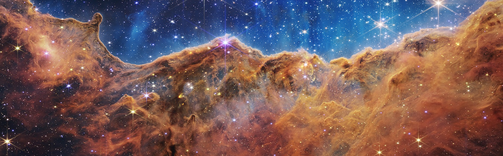
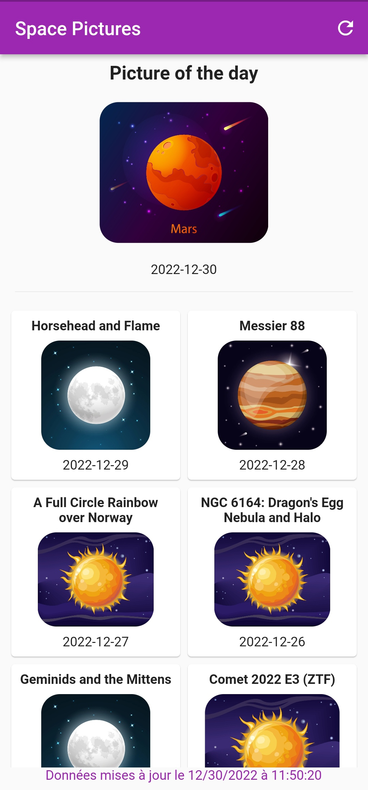
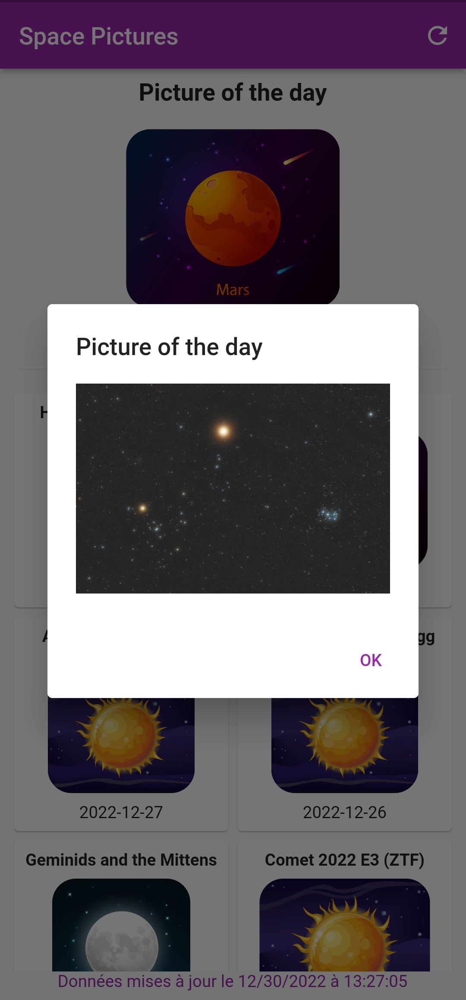
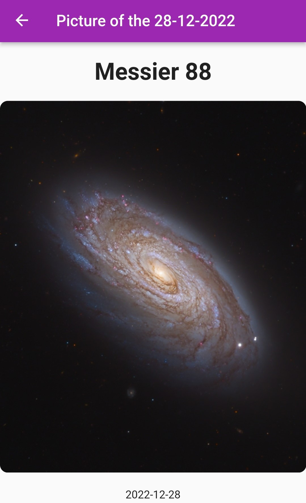
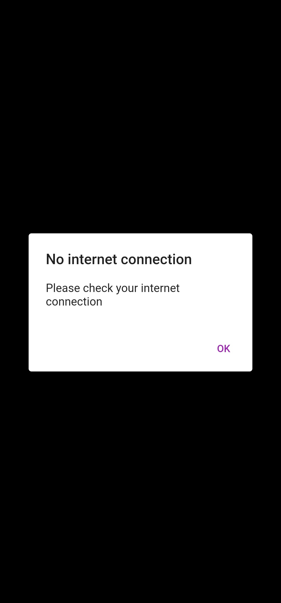
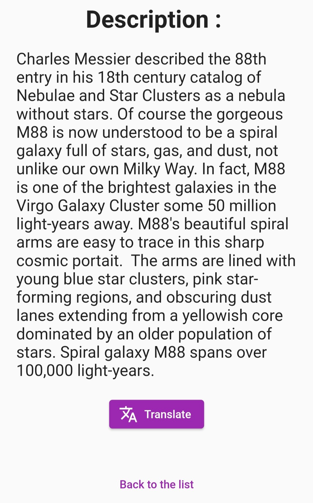
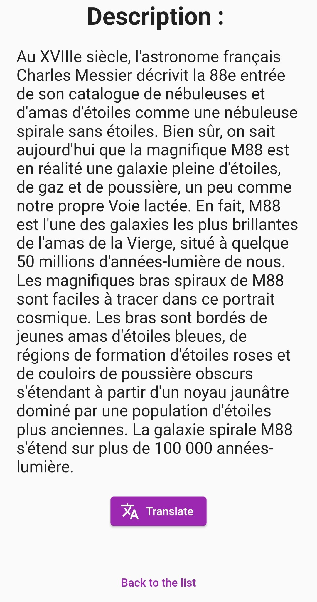

 

Space Pics
==========

Space Pictures
==============

_**LARZUL Hippolyte**_

**Space Pics** est une application mobile d’affichage de photos de l’espace et leurs descriptions, développée en 2022 dans le cadre du cours de Technologies Mobiles.

## **Sommaire :**

- [Introduction](#introduction)

- [Contrat d’interface](#contrat-dinterface)

  - [API NASA](#api-nasa)

  - [Traduction](#traduction)

- [Explications](#explications)

  - [Choix](#choix)

    - [Nom et Logo](#nom-et-logo)

    - [API](#api)

  - [Librairies](#librairies)

  - [Concepts](#concepts)

  - [Parc Matériel](#parc-matériel)

  - [Fonctionnement de l’application](#fonctionnement-de-lapplication)

- [Problèmes rencontrés](#problèmes-rencontrés)

- [Solutions apportées](#solutions-apportées)

## Introduction

**Space Pics** est une application développée en Flutter pour Android, IOS, Windows Desktop, MacOS, Linux et Web dans le cadre du cours de Technologies Mobiles à l’Université de Lille.

Cette application permet d’admirer des photos de l’espace envoyées par la Nasa une fois par jour, et en connaître davantage en anglais et en français.

La liste des images de la semaine précédente est affichée sur l’écran d’accueil. Le détail avec des informations complémentaires est disponible en cliquant sur une carte.

Contrat d’interface
===================

API NASA
--------

L’API principale utilisée est celle de la Nasa : _**[api.nasa.gov](https://api.nasa.gov/planetary/apod?api_key=DEMO_KEY)**_  et la route utilisée pour récupérer les informations avec la méthode GET est :

| Route | Paramètres | Code de retour |
| --- | --- | --- |
| [https://api.nasa.gov/planetary/apod](https://api.nasa.gov/planetary/apod?api_key=DEMO_KEY) | api\_key : string start\_date : string | 200 ; 500 |

**Réponse** **:** _(api\_key=DEMO\_KEY&start_date=2022-09-01)_

    [
      {
        "copyright": "Peter Kohlmann",
        "date": "2022-09-01",
        "explanation": "Framing a bright emission region, this telescopic view looks out along the plane of our Milky Way Galaxy toward the nebula rich constellation Cygnus the Swan. Popularly called the Tulip Nebula, the reddish glowing cloud of interstellar gas and dust is also found in the 1959 catalog by astronomer Stewart Sharpless as Sh2-101. Nearly 70 light-years across, the complex and beautiful Tulip Nebula blossoms about 8,000 light-years away. Ultraviolet radiation from young energetic stars at the edge of the Cygnus OB3 association, including O star HDE 227018, ionizes the atoms and powers the emission from the Tulip Nebula. Also in the field of view is microquasar Cygnus X-1, one of the strongest X-ray sources in planet Earth's sky. Blasted by powerful jets from a lurking black hole its fainter bluish curved shock front is only just visible though, beyond the cosmic Tulip's petals near the right side of the frame.   Back to School? Learn Science with NASA",
        "hdurl": "https://apod.nasa.gov/apod/image/2209/TulipCygX-1.jpg",
        "media_type": "image",
        "service_version": "v1",
        "title": "The Tulip and Cygnus X-1",
        "url": "https://apod.nasa.gov/apod/image/2209/TulipCygX-1_1024.jpg"
      },
      {
        "copyright": "Fabian Neyer",
        "date": "2022-09-02",
        "explanation": "Find the Big Dipper and follow the handle away from the dipper's bowl until you get to the last bright star. Then, just slide your telescope a little south and west and you'll come upon this stunning pair of interacting galaxies, the 51st entry in Charles Messier's famous catalog. Perhaps the original spiral nebula, the large galaxy with well defined spiral structure is also cataloged as NGC 5194. Its spiral arms and dust lanes clearly sweep in front of its companion galaxy (left), NGC 5195. The pair are about 31 million light-years distant and officially lie within the angular boundaries of the small constellation Canes Venatici. In direct telescopic views, M51 looks faint and fuzzy to the eye. But this remarkably deep image shows off details of the interacting galaxy's striking colors and galactic tidal debris. The image includes nearly 90 hours of narrowband data that also reveals a vast glowing cloud of reddish ionized hydrogen gas discovered in the M51 system.",
        "hdurl": "https://apod.nasa.gov/apod/image/2209/m51_l2.jpg",
        "media_type": "image",
        "service_version": "v1",
        "title": "M51: The Whirlpool Galaxy",
        "url": "https://apod.nasa.gov/apod/image/2209/m51_l2_1024.jpg"
      },
      {
        "copyright": "Wang Letian",
        "date": "2022-09-03",
        "explanation": "On August 25 Sun and Moon could both be seen in planet Earth's daytime skies. And so could the International Space Station. The ISS crossed the disk of the waning crescent Moon as seen from Shunyi district, Beijing, China at about 11:02 am local time. Some 40 kilometers to the southwest, in Fengtai district, the ISS was seen to cross the Sun's disk too. The solar transit was observed only 29 seconds later. Both transits are compared in these panels, composed of processed and stacked video frames from the two locations. The coordinated captures were made with different equipment, but adjusted to show the Sun and Moon at the same scale. The ISS was at a calculated range of 435 kilometers for the lunar transit and 491 kilometers when passing in front of the Sun.   Artemis I: Launch Update",
        "hdurl": "https://apod.nasa.gov/apod/image/2209/Interval29seconds_Transit.jpg",
        "media_type": "image",
        "service_version": "v1",
        "title": "Sun and Moon and ISS",
        "url": "https://apod.nasa.gov/apod/image/2209/Interval29seconds_Transit1200.jpg"
      },
      {
        "copyright": "Rudy Montoya",
        "date": "2022-09-04",
        "explanation": "very step caused the sand to light up blue. That glow was bioluminescence -- a blue radiance that also lights the surf in this surreal scene captured in mid-2018 at Meyer's Creek Beach in Oregon, USA. Volcanic stacks dot the foreground sea, while a thin fog layer scatters light on the horizon. The rays of light spreading from the left horizon were created by car headlights on the Oregon Coast Highway (US 101), while the orange light on the right horizon emanates from a fishing boat.  Visible far in the distance is the band of our Milky Way Galaxy, appearing to rise from a dark rocky outcrop.  Sixteen images were added together to bring up the background Milky Way and to reduce noise.    Your Sky Surprise: What picture did APOD feature on your birthday? (post 1995)",
        "hdurl": "https://apod.nasa.gov/apod/image/2209/MilkyWayOregon_Montoya_1500.jpg",
        "media_type": "image",
        "service_version": "v1",
        "title": "Sea and Sky Glows over the Oregon Coast",
        "url": "https://apod.nasa.gov/apod/image/2209/MilkyWayOregon_Montoya_960.jpg"
      },
      {
        "date": "2022-09-05",
        "explanation": "Stars created these cliffs. Specifically, the destructive winds and energetic light from the stars in the open cluster NGC 3324 eroded away part of a mountain of dark interstellar dust in the northern part of the Carina Nebula. Several of these stars are visible toward the top of this highly detailed image taken recently by the James Webb Space Telescope, the largest astronomical telescope ever launched. Webb's large mirror and ability to see dust-piercing infrared light has enabled it to capture fascinating details in the dust, hundreds of previously hidden stars, and even some galaxies far in the distance.  The featured jagged cliffs occur in part of Carina known as the Gabriela Mistral Nebula -- because when viewed in another orientation, they appear similar to the facial profile of the famous Chilean poet.  These nebular cliffs occur about 7,600 light years away toward the southern constellation of Carina.   Astrophysicists: Browse 2,800+ codes in the Astrophysics Source Code Library",
        "hdurl": "https://apod.nasa.gov/apod/image/2209/CarinaCliffs_Webb_2000.jpg",
        "media_type": "image",
        "service_version": "v1",
        "title": "Carina Cliffs from the Webb Space Telescope",
        "url": "https://apod.nasa.gov/apod/image/2209/CarinaCliffs_Webb_1080.jpg"
      },
      {
        "copyright": "Jiaqi Sun （孙嘉琪）",
        "date": "2022-09-06",
        "explanation": "Yes, but how many dark clouds have a multicolored lining? Pictured, behind this darker cloud, is a pileus iridescent cloud, a group of water droplets that have a uniformly similar size and so together diffract different colors of sunlight by different amounts.  The featured image was taken last month in Pu'er, Yunnan Province, China. Also captured were unusual cloud ripples above the pileus cloud.  The formation of a rare pileus cloud capping a common cumulus cloud is an indication that the lower cloud is expanding upward and might well develop into a storm.    Explore Your Universe: Random APOD Generator",
        "hdurl": "https://apod.nasa.gov/apod/image/2209/Pileus_Jiaqi_4032.jpg",
        "media_type": "image",
        "service_version": "v1",
        "title": "An Iridescent Pileus Cloud over China",
        "url": "https://apod.nasa.gov/apod/image/2209/Pileus_Jiaqi_960.jpg"
      },
      {
        "copyright": "NASAESACSASTScI",
        "date": "2022-09-07",
        "explanation": "Near the center of a nearby star-forming region lies a massive cluster containing some of the largest and hottest stars known.  Collectively known as star cluster NGC 2070, these stars are part of the vast Tarantula Nebula and were captured in two kinds of infrared light by the new Webb Space Telescope.  The main image shows the group of stars at NGC 2070's center -- known as R136 -- in near-infrared, light just a bit too red for humans to see. In contrast, the rollover image captures the cluster center in mid-infrared light, light closer to radio waves.  Since R136's brightest stars emit more of their light in the near infrared, they are much more prominent on that image. This LMC cluster's massive stars emit particle winds and energetic light that are evaporating the gas cloud from which they formed. The Webb images, released yesterday, shows details of R136 and its surroundings that have never been seen before, details that are helping humanity to a better understanding of how all stars are born, evolve and die.",
        "hdurl": "https://apod.nasa.gov/apod/image/2209/TarantulaNearIr_Webb_1396.jpg",
        "media_type": "image",
        "service_version": "v1",
        "title": "Tarantula Stars R136 from Webb",
        "url": "https://apod.nasa.gov/apod/image/2209/TarantulaNearIr_Webb_960.jpg"
      },
      {
        "copyright": "Frank Sackenheim",
        "date": "2022-09-08",
        "explanation": "Fans of our fair planet might recognize the outlines of these cosmic clouds. On the left, bright emission outlined by dark, obscuring dust lanes seems to trace a continental shape, lending the popular name North America Nebula to the emission region cataloged as NGC 7000. To the right, just off the North America Nebula's east coast, is IC 5070, whose avian profile suggests the Pelican Nebula.  The two bright nebulae are about 1,500 light-years away, part of the same large and complex star forming region, almost as nearby as the better-known Orion Nebula. At that distance, the 3 degree wide field of view would span 80 light-years. This careful cosmic portrait uses narrowband images combined to highlight the bright ionization fronts and the characteristic glow from atomic hydrogen, and oxygen gas. These nebulae can be seen with binoculars from a dark location.  Look northeast of bright star Deneb in Cygnus the Swan, soaring high in the northern summer night sky.",
        "hdurl": "https://apod.nasa.gov/apod/image/2209/NGC7000_NB_2022_2048.jpg",
        "media_type": "image",
        "service_version": "v1",
        "title": "North America and the Pelican",
        "url": "https://apod.nasa.gov/apod/image/2209/NGC7000_NB_2022_1024.jpg"
      }
    ]

Traduction
----------

Une autre requête est envoyée pour obtenir la traduction en français de la description d’une image. Cette requête n’est pas faite sur une API, mais sur un site web : **_[Ciel des Hommes](https://www.cidehom.com/apod.php)_** avec comme paramètre la date, la réponse est ensuite réduite pour récupérer uniquement la description en français.

| Route | Paramètres | Code de retour |
| --- | --- | --- |
| [https://www.cidehom.com/apod.php](https://www.cidehom.com/apod.php) | _date : string | 200 ; 500 |

**Réponse** **:** _(_date=220908)_

    <!DOCTYPE html>
    <html lang="fr-FR">
    	<head>
    	  
    	  <meta charset="utf-8">
    	  <title>L'Amérique du Nord et le Pélican</title>
    	  [...]
    	
    	</head>
    	<body>
    	
    	

    	
    	  <h1>L'Amérique du Nord et le Pélican</h1>
    		
Si vous êtes fan de notre belle planète, vous reconnaîtrez les contours de ces nuages cosmiques. Sur la gauche, la nébuleuse 
    				par émission est célèbre en partie du fait de sa ressemblance assez frappante avec le continent Nord-Américain, connue sous la référence NGC 7000. Sur la droite près de la côte est de la nébuleuse Amérique du Nord, on trouve la nébuleuse IC 5070 qui 
    				ressemble à un pélican, d'où son nom. Ces deux nébuleuses par émission se trouvent à quelque 1.500 années-lumière, elles font partie d'une grande et complexe région de formation d'étoiles guère plus éloignée de nous que la plus célèbre nébuleuse d'Orion. À leur distance, ce champ de 3° dans notre ciel correspond à une largeur de 80 années-lumière. Cette image travaillée combine différents filtres pour capturer à la fois les fronts lumineux d'ionisation et les rayonnements caractéristiques des atomes d'hydrogène et d'oxygène. Ces deux nébuleuses peuvent être vues avec des jumelles depuis un endroit suffisamment sombre. Vous devrez les chercher au nord-est de la brillante étoile Deneb, dans la constellation du Cygne, qui grimpe haut dans le ciel d'été de l'hémisphère nord.

    		
    		

    			
<b>L'image d'astronomie du jour (Astronomy Picture Of the Day - APOD)</b>

    			
Traduction réalisée par Patrick Babayou

    		  
<a href="http://apod.nasa.gov/apod/ap220908.html" target="_blank">&gt; lire le texte original</a> sur le site de la NASA

    			
Auteurs et éditeurs&nbsp;: <a href='http://antwrp.gsfc.nasa.gov/htmltest/rjn.html' target='_blank'>Robert Nemiroff</a> (<a href='http://www.phy.mtu.edu/'>MTU</a>) &amp; <a href='http://antwrp.gsfc.nasa.gov/htmltest/jbonnell/www/bonnell.html' target='_blank'>Jerry Bonnell</a> (<a href='http://www.astro.umd.edu/' target='_blank'>UMCP</a>)

    			
Représentant technique de la Nasa&nbsp;: <a href='mailto:jpn@grossc.gsfc.nasa.gov' target='_blank'>Jay Norris</a>

    			
Un service de&nbsp;: <a href='http://science.gsfc.nasa.gov/sed/index.cfm?fuseAction=home.main&&navOrgCode=660' target='_blank'>ASD</a> de <a href='http://www.nasa.gov/' target='_blank'>NASA</a> / <a href='http://www.gsfc.nasa.gov/' target='_blank'>GSFC</a> & <a href='http://www.mtu.edu/' target='_blank'>Michigan Tech. U.</a>

    		

    	

    	
    	[...]
    	  
    	</body>
    </html>

Réponse après traitement :

    Si vous êtes fan de notre belle planète, vous reconnaîtrez les contours de ces nuages cosmiques.
    Sur la gauche, la nébuleuse par émission est célèbre en partie du fait de sa ressemblance assez frappante
     avec le continent Nord-Américain, connue sous la référence NGC 7000.
    Sur la droite près de la côte est de la nébuleuse Amérique du Nord, on trouve la nébuleuse IC 5070
    qui ressemble à un pélican, d'où son nom.
    Ces deux nébuleuses par émission se trouvent à quelque 1.500 années-lumière, 
    elles font partie d'une grande et complexe région de formation d'étoiles 
    guère plus éloignée de nous que la plus célèbre nébuleuse d'Orion. 
    À leur distance, ce champ de 3° dans notre ciel correspond à une largeur de 80 années-lumière.
    Cette image travaillée combine différents filtres pour capturer à la fois les fronts lumineux d'ionisation
    et les rayonnements caractéristiques des atomes d'hydrogène et d'oxygène.
    Ces deux nébuleuses peuvent être vues avec des jumelles depuis un endroit suffisamment sombre.
    Vous devrez les chercher au nord-est de la brillante étoile Deneb, dans la constellation du Cygne,
    qui grimpe haut dans le ciel d'été de l'hémisphère nord.

Explications
============

Choix
-----

### Nom et Logo

Le nom de **Space Pics** a été choisi pour exprimer le fait qu’il s’agit de photos de l’espace à observer.

Ce logo a été adopté car il représente l’espace avec la planète et l’exploration avec la fusée. Il existe sous plusieurs formats pour s’adapter à chaque appareil et chaque plateforme.

### API

L’API de la NASA a été choisie avant de savoir la forme et les fonctionnalités de l’application, car il s’agit de la plus grande agence spatiale et que plusieurs API sont proposées au public, avec diverses informations partagées. Parmi toutes les API mises à disposition par la NASA, l’[APOD](https://github.com/nasa/apod-api) a été choisie car il s’agit de la plus populaire et son [site Web](http://apod.nasa.gov/apod/astropix.html) est l'un des [plus populaires](https://analytics.usa.gov/) de tous les organismes fédéraux.

Le site web [Ciel des Hommes](https://www.cidehom.com/apod.php) est le seul site qui correspond aux données fournies par la NASA traduites en français. Il est aussi référencé sur le site officiel [APOD](https://apod.nasa.gov/apod/lib/about_apod.html), qui liste pour chacun des pays un site web et son auteur.

Librairies
----------

Les librairies utilisées pour l’application sont :

| Nom | Description |
| --- | --- |
| **[cupertino_icons](https://pub.dev/packages/cupertino_icons)** | Affichage des icones |
| **[dio](https://pub.dev/packages/dio)** | Client Http qui récupère les données des API |
| [**json_annotation**](https://pub.dev/packages/json_annotation) | Définit les annotations utilisées par [json_serializable](https://pub.dev/packages/json_serializable) pour créer du code pour la sérialisation et la désérialisation JSON |
| **[youtube\_player\_flutter](https://pub.dev/packages/youtube_player_flutter)** | Plugin Flutter pour lire des vidéos YouTube |
| **[vimeo\_video\_player](https://pub.dev/packages/vimeo_video_player)** | Lecteur vidéo pour les vidéos Vimeo |
| **[intl](https://pub.dev/packages/intl)** | Fournit des fonctionnalités d'internationalisation et de localisation, utile pour les formats de date |
| **[sensors_plus](https://pub.dev/packages/sensors_plus)** | Un plugin Flutter pour accéder aux capteurs de l'accéléromètre, du gyroscope et du magnétomètre |
| **[internet\_connection\_checker](https://pub.dev/packages/internet_connection_checker)** | Vérificateur de connexion internet |

Concepts
--------

L’architecture utilisée ici est le MVVM (Model-View-ViewModel) qui est notamment poussée par Google, et qui permet de découpler l'interface utilisateur et le code qui ne lui est pas associé.

Aucune donnée n’est stockée en local, à chaque fois que l’application est lancée, ou que l’utilisateur appuie sur le bouton de rafraîchissement, une requête est envoyée à l’API pour récupérer les informations et les afficher.

Toutefois, si l’appareil n’est pas connecté à internet, et donc ne peut envoyer de requête, un pop-up s’affiche pour prévenir l’utilisateur.

Tant que l’API ne renvoie pas de réponse, un écran de chargement s’affiche.

Le capteur d’accélération est utilisé pour détécter une secousse de l’utilisateur et ainsi afficher l’image du jour sous forme de pop-up.

Parc Matériel
-------------

Space Pics a été conçue pour Android avec une version supérieure ou égale à 10. La version ciblée est Android 12 pour permettre de développer avec les dernières fonctionnalités.

Grâce à Flutter, l’application est un logiciel multiplateforme et peut être disponible sur Android, IOS, Windows Desktop, MacOS, Linux et Web.

Fonctionnement de l’application
-------------------------------

L’application est très simple et intuitive à utiliser. Le but est d’afficher la photo du jour envoyée par la NASA avec sa description, puis la même chose pour la semaine précédente.

En haut de la page principale une image est affichée en grand avec une planète, puis plus bas une grille de sept images correspondant aux sept jours précédents peut être défilée.

Ces images sont sélectionnées en fonction de la description du jour correspondant, si celle-ci contient le nom d’une planète, un dessin de la planète est choisi pour illustrer le jour précis.

Quand l’utilisateur clique sur l’une de ces images, une nouvelle page apparaît avec le détail du jour comprenant :

* Le titre de la photo

* La photo du jour

* La date

* La description

* Un bouton pour traduire

* Un bouton de retour  

  
Plusieurs fonctionnalités sont disponibles en plus de l’affichage des photos :

* Le rafraîchissement de la vue principale en appuyant sur le bouton ‘refresh’

* La traduction en français de la description d’une photo est possible en cliquant sur le bouton ‘Translate’

* Quand l’utilisateur secoue son mobile, l’image du jour s’affiche

* Si l’utilisateur n’est pas connecté à internet, un pop-up d’erreur lui sera renvoyé

Les screenshots suivants montrent le fonctionnement de l’application.

|  |  |  |
| --- | --- | --- |
|  |  |  | 
|  |  | 

Problèmes rencontrés
====================

1.  Choisir l’image à afficher comme couverture

2.  L’ordre des données renvoyées pour le listing s’affiche par défaut dans l’ordre décroissant

3.  À certains moments la photo du jour est une vidéo, le format change donc et il faut afficher et pouvoir jouer des vidéos

4.  Le capteur d’accélération est très sensible et renvoie des données à chaque micro-mouvement du mobile

5.  Afficher un seul pop-up quand le mobile est secoué

6.  Savoir quand le mobile est connecté à internet

7.  Comment avoir une traduction de la description
    
    * Changement de type de date pour la traduction
    
    * Découper la réponse pour la traduction

Solutions apportées
===================

1.  Deux fonctions ont été crées pour choisir l’image :
    
    * La première détecte les planètes citées dans la description et renvoie l’illustration de la planète correspondante.
    
    * Si aucune planète n’est citée, une image aléatoire est renvoyée.

2.  Dans l’affichage de grille, prendre la longueur de la liste de données, et la parcourir à l’envers.

3.  Les vidéos sont toujours sous le format Youtube ou Viméo, il a donc fallu ajouter la distinction et importer deux plugins pour jouer ces vidéos. Cette fonctionnalité n’est disponible que sur mobile.

4.  Une calibration et des tests ont été menés pour adapter la détection à une secousse volontaire du mobile par l’utilisateur.

5.  Au début, dès que le capteur reconnaîssait une secousse, un pop-up apparaîssait en surcouche du précédent, ce qui donnait rapidement une dizaine de pop-up superposés. Un booléen pour savoir quand le pop-up est affiché ou non a été mis en place.

6.  Beaucoup de librairies existent pour avoir ces informations. Une fonction détecte au démarrage s’il est possible de se connecter à internet, si non un pop-up est renvoyé.

7.  Aucune donnée de la NASA n’est renvoyée traduite, il a donc fallu les trouver autre part. Sur le site officiel il y a une liste des pays, avec pour chacun un site de référence. Les données peuvent donc être récupérées de là avec une nouvelle requête.
    
    * Une page est consacrée à chaque jour, avec pour paramètre la date mais sous un format différent de celui récupéré initialement. Des manipulations sont alors appliquées sur la date dans la requête pour ensuite obtenir la page de chaque jour.
    
    * La donnée récupérée est alors du code HTML, qui est ensuite découpé selon une balise ‘&lt;p&gt;’ pour obtenir la description en français, qui est affichée quand l’utilisateur clique sur le bouton ‘Translate’.

